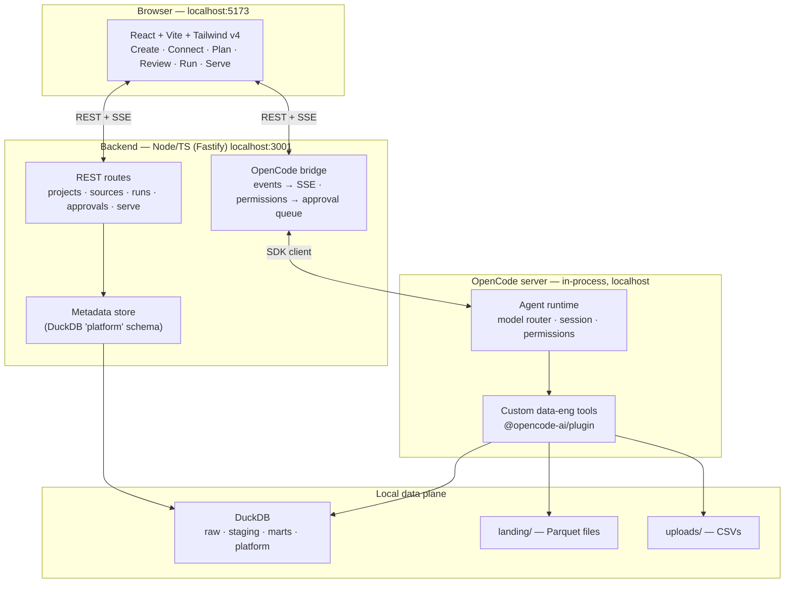
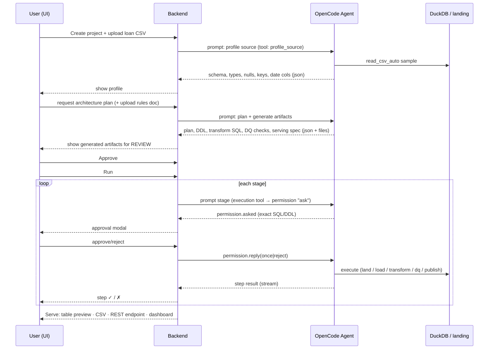
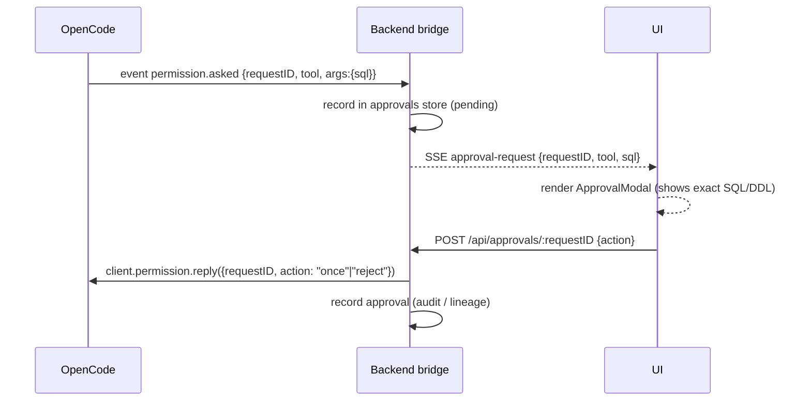

# DataStack One — Architecture

Last updated: 2026-07-16
Status: **proposed — awaiting confirmation**

This document describes how the MVP is built. It is the technical companion to
[`PRD.md`](./PRD.md). Where the PRD says *what*, this says *how*.

---

## 1. Guiding principles

1. **Don't build the harness — drive one.** OpenCode provides the agent loop, tool
   calling, sandboxed execution, permission gating, and event streaming. We build the
   *data-engineering* part: the tools, the pipeline, and the UI.
2. **Local-first.** Everything runs on `127.0.0.1`. No cloud, no deploy, no auth server.
   The "platform" is a local web app you open in a browser, like Prisma Studio.
3. **Constrain the agent.** A free-roaming coding agent is impressive but flaky on stage.
   We give it a **fixed toolset** and a **fixed pipeline of steps**, each with a
   structured-output contract. The agent fills the gaps; it does not invent the stack.
4. **Approve before execute.** Every tool that writes or runs code is permission-gated.
   Nothing mutates data or runs SQL without an explicit human click.
5. **One engine now, many later.** DuckDB is the whole warehouse for the MVP. The tool
   interfaces are written so Postgres / Spark / MinIO can slot in behind them later.

---

## 2. System overview



**Three processes conceptually, one command to run.** The OpenCode server is spawned
in-process by the backend via `createOpencode(...)`, so `npm run dev` starts the backend
(with OpenCode inside it) and the Vite dev server for the UI.

---

## 3. Component responsibilities

### 3.1 Frontend — `web/`
- React 19 + Vite + Tailwind v4 (CSS-first, `@tailwindcss/vite`).
- A 6-step wizard mirroring the product flow. Each step is a route.
- Subscribes to backend **SSE** for two streams:
  - **progress events** (agent reasoning + task-level step status), and
  - **approval requests** (renders the modal that gates execution).
- No business logic — it renders state and posts user intent (upload, approve, run).

### 3.2 Backend — `server/`
- **Fastify** HTTP server on `:3001`. Owns:
  - REST routes for the product (see §7).
  - The **OpenCode client** and the **bridge** that relays events + permissions.
  - The **metadata store** (projects, sources, runs, artifacts, DQ results, approvals).
  - The dynamically-registered **serving endpoints** (`/api/serve/:name`).
- `server/core/` is pure (no fs/net) and holds schemas + pipeline definitions;
  `server/tools`, `server/routes`, `server/opencode` may do I/O. (Same discipline as
  the `useme` core/cli split.)

### 3.3 Agent runtime — OpenCode
- Spawned via `createOpencode({ config: { model: "opencode/big-pickle", permission: {...} } })`.
- Runs **one primary agent** ("Data Platform Engineer") with the full custom toolset.
- The backend drives it as a **scripted pipeline**: one `session.prompt` per stage, each
  constrained to the tools and the `json_schema` output that stage needs. This keeps runs
  deterministic and demo-safe while still being genuinely agentic within each stage.

### 3.4 Data plane
- **DuckDB** single file `data/warehouse.duckdb` with schemas:
  - `platform` — our metadata (projects, runs, artifacts, dq_results, approvals).
  - `raw` — landed source data loaded from Parquet.
  - `staging` — cleaned/typed staging tables.
  - `marts` — final business tables that get served.
- **`data/landing/`** — Parquet written by the land step (`COPY ... TO ... (FORMAT PARQUET)`),
  partitioned by ingestion date. This is our "S3." Upgrade path: point DuckDB at a MinIO
  S3 endpoint — the tool interface doesn't change.
- **`data/uploads/`** — raw uploaded CSVs.

---

## 4. The runtime pipeline (what a user actually does)



Six visible pipeline steps (satisfies "≥5 visible tasks"):
**Extract → Land Parquet → Load Warehouse → Transform → DQ Checks → Publish.**

---

## 5. Custom tools — the heart of the product

Registered via `@opencode-ai/plugin`. Each is a real TypeScript function the agent calls.
Permission column shows the default (`allow` = runs freely, `ask` = human-gated).

| Tool | Args | Does | Permission |
|------|------|------|-----------|
| `profile_source` | `path` | Profiles CSV via DuckDB `read_csv_auto`: schema, types, row count, null %, candidate PKs, date columns. Read-only. | `allow` |
| `read_rules` | `path` | Reads the plain-English transformation rules document. | `allow` |
| `write_artifact` | `path, content` | Writes a generated artifact (SQL, DDL, DAG json) into `artifacts/` for UI review. Does not execute. | `allow` |
| `land_parquet` | `source, partitionBy` | Writes raw data to `landing/` as partitioned Parquet. | **`ask`** |
| `load_warehouse` | `parquetPath, table` | Loads Parquet into a `raw`/`staging` DuckDB table. | **`ask`** |
| `run_transform` | `sql` | Executes transformation SQL, creating `marts` tables. The riskiest tool. | **`ask`** |
| `run_dq_check` | `checks[]` | Runs data-quality checks (row count, null, schema, freshness). Returns pass/fail. Blocks publish on fail. | `allow` |
| `publish_serving` | `table, format` | Registers a served table, generates a REST endpoint + CSV export. | **`ask`** |

**How the PRD's 7 agents map here:** they become **prompt phases + tools + hooks**, not
7 separate processes.

| PRD agent | Realized as |
|-----------|-------------|
| 1. Source Profiler | `profile_source` tool + profile stage prompt |
| 2. Architecture Planner | plan stage prompt (json_schema plan) |
| 3. Orchestration Builder | pipeline definition + generated DAG artifact |
| 4. Transformation Engineer | `read_rules` + `write_artifact` + transform stage prompt |
| 5. Data Quality Reviewer | `run_dq_check` + `tool.execute.before` guard (block publish if DQ failed) |
| 6. Serving Layer Builder | `publish_serving` + dynamic `/api/serve/:name` route |
| 7. Safety & Approval Gate | OpenCode **permission system** (`ask` on write/execute tools) |

---

## 6. The approval gate (concrete)



- Config: `permission: { "*": "allow", "land_parquet": "ask", "load_warehouse": "ask", "run_transform": "ask", "publish_serving": "ask" }`.
- Reply actions: `"once"` (approve this call), `"reject"` (deny). We deliberately do **not**
  expose `"always"` in the MVP — the PRD requires **100% approval before execution**.
- Every asked/replied pair is written to the run's lineage for observability.

---

## 7. Backend REST surface (MVP)

| Method | Route | Purpose |
|--------|-------|---------|
| `POST` | `/api/projects` | Create project (name, domain, volume, warehouse=duckdb). |
| `GET` | `/api/projects` | List projects. |
| `POST` | `/api/projects/:id/source` | Upload CSV (multipart) → stores in `uploads/`. |
| `POST` | `/api/projects/:id/profile` | Run `profile_source`, return profile json. |
| `POST` | `/api/projects/:id/plan` | Generate plan + artifacts (accepts rules doc). |
| `GET` | `/api/projects/:id/artifacts` | Fetch generated SQL/DDL/DAG/DQ for review. |
| `POST` | `/api/projects/:id/run` | Start pipeline run. |
| `GET` | `/api/runs/:runId/events` | **SSE** — progress + approval-request stream. |
| `POST` | `/api/approvals/:requestID` | Approve/reject a permission request. |
| `GET` | `/api/serve/:name` | Dynamically-served result table (generated endpoint). |
| `GET` | `/api/serve/:name.csv` | Download served table as CSV. |
| `GET` | `/api/models` | List providers+models from `config.providers()`. |

---

## 8. Model routing

- Default: `opencode/big-pickle` (free Zen model) — set in OpenCode config at boot.
- `GET /api/models` calls `client.config.providers()` → UI model-picker populates live.
- **Quality-tier toggle:** UI can select any `provider/model`. If a paid provider is
  chosen, the backend calls `client.auth.set(...)` with the key from env
  (`ANTHROPIC_API_KEY`, etc.) before prompting; per-run model passed via
  `session.prompt({ model: { providerID, modelID } })`.
- **Known risk:** small free models are weaker at multi-step tool use + json_schema
  output than top-tier paid models. Mitigation: build model-agnostic, dev on `big-pickle`,
  keep the toggle to a stronger paid model one click away for when the free model flakes. See
  [`PRD.md` §Risks](./PRD.md).

---

## 9. Folder structure

```
data-engineer-platform/
├── PRD.md · ARCHITECTURE.md · TASKS.md · PROGRESS.md · AGENTS.md · LOOP.md · PROMPT.md
├── loop.sh
├── package.json · tsconfig.json · vitest.config.ts
├── server/
│   ├── index.ts                 # boot: createOpencode + Fastify + register tools
│   ├── core/                    # PURE: schemas (zod), pipeline stage defs, types
│   │   ├── schemas.ts · pipeline.ts · types.ts
│   ├── opencode/
│   │   ├── client.ts            # createOpencode, config, permissions
│   │   ├── bridge.ts            # event.subscribe → SSE; permission queue
│   │   └── models.ts            # config.providers wrapper
│   ├── tools/                   # custom @opencode-ai/plugin tools
│   │   ├── profile.ts · land.ts · warehouse.ts · transform.ts · dq.ts · serve.ts
│   ├── pipeline/                # scripted stage runner (profile→plan→run)
│   ├── routes/                  # projects · sources · runs · approvals · serve · models
│   ├── store/
│   │   └── duckdb.ts            # connection + platform-schema migrations
│   └── serving/                 # dynamic /api/serve/:name registry
├── web/
│   └── src/
│       ├── main.tsx · App.tsx · index.css   # @import "tailwindcss";
│       ├── pages/  Create · Connect · Plan · Review · Run · Serve
│       ├── components/  SchemaTable · DagView · ApprovalModal · ProgressStepper · DataTable · ModelPicker
│       └── lib/  api.ts · sse.ts
├── data/                        # gitignored
│   ├── warehouse.duckdb · landing/ · uploads/ · artifacts/
└── fixtures/                    # synthetic lending CSV + rules doc (committed)
    ├── loans_sample.csv · rules.txt
```

**Discipline (from `useme`):** `server/core` is pure and imported by everything; it never
imports `routes`/`tools`. TS strict, ESM NodeNext (relative imports end in `.js`).

---

## 10. Tech stack (locked for MVP)

| Layer | Choice | Why |
|-------|--------|-----|
| Language | TypeScript (strict, ESM NodeNext) | Matches OpenCode SDK + `useme` conventions |
| Agent runtime | `@opencode-ai/sdk` + `@opencode-ai/plugin` | The harness we drive, not build |
| Default model | `opencode/big-pickle` (free) | Prototype cost = 0; model-agnostic |
| Backend | Fastify + tsx (dev) | Lightweight, proven in `useme` |
| Frontend | React 19 + Vite + Tailwind v4 | CSS-first Tailwind, fast local dev |
| DAG view | React Flow *(optional)* | Renders the workflow graph; can start with a simple stepper |
| Warehouse | DuckDB (`@duckdb/node-api`) | Embedded, zero-setup, Parquet-native |
| Landing | Local Parquet (DuckDB `COPY`) | "Simulated S3"; swap to MinIO later |
| Validation | zod | Tool args + API bodies + json_schema |
| Tests | vitest | Matches `useme` |
| UI↔server stream | Server-Sent Events | Simpler than WebSockets for one-way progress |

---

## 11. What is explicitly deferred (not in MVP)

MinIO / real S3 · Postgres/Snowflake/Spark engines · mock API + Postgres source connectors
(CSV only for MVP) · scheduling/cron · multi-user/auth · cost estimation · lineage graph UI
(text lineage only) · streaming/CDC. All have a slot in the tool interfaces so they add
without a rewrite. See [`PRD.md` §Non-goals](./PRD.md).
