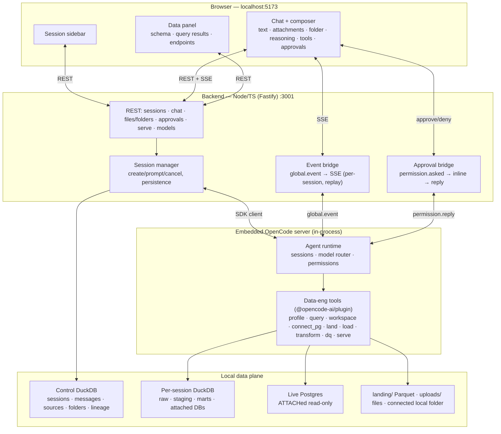
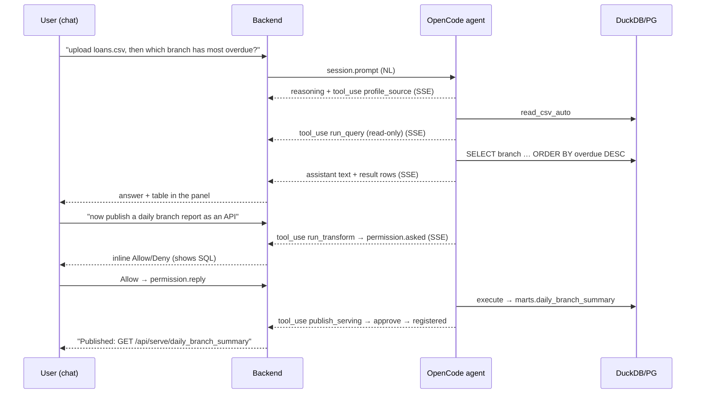

# DataStack One — Architecture (v2: Conversational Agent)

Last updated: 2026-07-19
Status: **implemented** · supersedes the v1 wizard architecture

Technical companion to [`PRD.md`](./PRD.md). The blueprint is the two Crux apps in this
workspace (`opencode-cowork` backend, `crux-frontend-rebrand` chat UI), sized down for a
single-user localhost app.

---

## 1. Guiding principles

1. **The agent is the interface.** Natural language in → the agent calls tools → results
   stream back. No wizard, no fixed pipeline.
2. **Don't build the agent loop — drive OpenCode.** We own one embedded OpenCode server and
   drive **sessions** through it.
3. **Tools are the only way to touch data.** The agent's *capabilities* are a fixed, audited
   tool set; it chooses the *order*. Writes are approval-gated; reads (profile, query) are free.
4. **Local & single-user.** Everything on `127.0.0.1`. One OpenCode server, many sessions.
   Agent turns are concurrent inside OpenCode; each chat gets a separate on-disk DuckDB execution
   catalog so data-plane names cannot collide.
5. **Reuse the v1 engine.** Keep the data tools and DuckDB; replace the shell and control flow.

---

## 2. System overview



**One command.** `npm run dev` boots the backend (with the embedded OpenCode server inside
it) and the Vite dev server. No Electron.

---

## 3. Backend (`server/`)

### 3.1 OpenCode + sessions
- **One embedded server**: `createOpencode({ config: { model, permission, plugin } })` at
  boot. Default model `opencode/big-pickle`.
- **Session manager** (`server/opencode/sessions.ts`): `client.session.create` per chat
  session; `client.session.prompt({ path:{id}, body:{ parts:[{type:'text',text}], model }})`
  to send an NL turn; `session.abort` to cancel. A session's id + title + model + message
  history persist in the control DuckDB `platform` schema so it reopens. An omitted create title
  stays omitted: OpenCode's native first-prompt title generator is canonical, and
  `session.updated` mirrors the generated title into the control store/sidebar.
- **Working directory**: folder selection calls `session.create` with
  `query.directory=<canonical selected folder>`. OpenCode fixes cwd at creation, so changing
  folders creates a new independent session; every later prompt/update/abort/delete addresses
  that directory-scoped runtime. A connected folder is never a cosmetic chip over the backend cwd.
- **Concurrency/status**: the `/global/event` subscription consumes events from every directory,
  while `/api/sessions/status` queries each active workspace instance to recover background work
  on reload. `session.updated` keeps titles current. Switching the
  active browser chat is only a view change—it never calls `session.abort`.
- **Context injection** (optional, Crux pattern): `noReply` prompts to tell the agent about a
  newly connected source without triggering a reply.

### 3.2 Event bridge (`server/opencode/bridge.ts`)
- One `client.global.event()` loop unwraps cross-directory OpenCode events → our SSE:
  `message.part.updated`→text/reasoning deltas, tool parts→tool-call events (name/args/
  status), `session.idle`→turn done. Fanned to `GET /api/events` with **per-session routing**
  and a **monotonic-seq replay buffer** (reconnect via `?lastSeq`). Mirrors Crux `sse.ts`.

### 3.3 Approval bridge (`server/opencode/approvals.ts`)
- `permission.asked` (fired when an `ask` tool is about to run) → recorded pending → emitted
  as an SSE `approval` event with the exact SQL/DDL → answered by
  `POST /api/approvals/:requestID` → `client.permission.reply({ requestID, action })`. No
  `always` — every write is approved once (PRD FR10). Each ask/reply logged to lineage.

### 3.4 Data tools (`server/tools/`, one `@opencode-ai/plugin`)
The agent-facing capabilities. Registered via `config.plugin` (a plugin module returning a
`tool` map). Permissions from `config.permission`.

| Tool | Args | Does | Permission |
|------|------|------|-----------|
| `list_sources` | — | List connected sources in the session. | allow |
| `profile_source` | `source` | Schema, types, rows, null %, keys, date cols (DuckDB). | allow |
| `run_query` | `sql` | **Read-only** SELECT over the session DuckDB (+ attached Postgres). Returns rows. | allow |
| `list_workspace_files` | — | Supported files in this chat's connected folder; relative paths only. | allow |
| `read_workspace_file` | `path` | Bounded read of a supported uploaded/folder text file. | allow |
| `write_workspace_file` | `path, content` | Create/replace a supported text project file, then refresh the index. | **ask** |
| `attach_source` | `name` | ATTACH a **registered** connection (by name) read-only; the backend resolves name→URL. Never receives the raw URL. | **ask** |
| `land_parquet` | `source, partitionBy` | `COPY … TO landing/… (FORMAT PARQUET)`. | **ask** |
| `load_warehouse` | `parquet, table` | Parquet → `raw`/`staging`. | **ask** |
| `run_transform` | `sql` | Execute transform SQL → `marts`. | **ask** |
| `run_dq_check` | `checks[]` | Row count / null / schema / freshness; block later publish on fail. | allow |
| `publish_serving` | `table` | Register a served table + CSV export. | **ask** |

Heavy/credentialed work the plugin can't do in-process calls back to the backend over
loopback (Crux `internal.ts` pattern) — kept minimal for the MVP.

### 3.5 REST surface
`/api/sessions` (CRUD) · `/api/sessions/:id/chat` · `…/cancel` · `/api/events` (SSE) ·
`/api/sessions/:id/sources` (multi-file upload / list) · `/api/sessions/:id/folder` ·
`/api/sessions/:id/folder/refresh` · `/api/folders` · `/api/approvals/:requestID` ·
`/api/serve/:name` · `/api/serve/:name.csv` · `/api/models` ·
`/api/connections` (add/list/delete — secrets never returned) · `/api/connections/:name/test`.

### 3.6 Data plane and session isolation
`data/warehouse.duckdb` is the **control plane**: sessions, messages (including attachment
references), source/folder registrations, connections, lineage, and the served registry.
`SessionWarehouseRegistry` lazily opens `data/sessions/<safe-session-id>/warehouse.duckdb` for
each OpenCode session. `raw`/`staging`/`marts`, transient source views, and read-only Postgres
attachments live only there. Equal table names in two chats are therefore different catalogs.
Uploads land under the owning session; Parquet/serving exports are session namespaced, and public
served names receive a session prefix because the legacy URL registry is globally keyed by name.

### 3.7 Local folder boundary (`server/workspace/`)
- The composer opens a server-backed folder picker; the browser never supplies an arbitrary path
  directly to a model. Folder routes accept only loopback origins and reject cross-site fetches.
- The selected canonical path is passed to OpenCode at session creation as its real cwd. Because
  that cwd is immutable, the picker starts and activates a new chat; the prior chat keeps running.
  Legacy mutate/disconnect routes return `409` rather than displaying a folder that tools do not use.
- Roots default to the user's home and can be narrowed with `DATASTACK_FOLDER_ROOTS`. Every browse,
  scan, read, and write resolves canonical paths and verifies containment.
- Scans ignore symlinks, hidden/generated directories, unsupported extensions, and sensitive
  names such as `.env*`, `profiles.yml`, and credentials files. Reads are bounded; model-facing
  values contain relative paths only. Writes are text-only, create/replace only, and approval-gated.

### 3.8 Connections & secrets (`server/connections/`)
- A **Settings → Connections** panel is the *only* place a database URL is entered. It
  registers Postgres (Neon) connections and stores the secret **server-side and gitignored**
  (`platform.connections` in DuckDB or `data/connections.json` — never committed, never sent
  to the browser).
- **Name-based resolution (hard rule).** Agent tools take a connection/source **name**; the
  backend resolves name → URL and runs `ATTACH '<url>' AS <name> (TYPE postgres, READ_ONLY)`.
  The raw URL/password **never** enters a prompt, an SSE event, or a model-produced tool
  argument (Crux loopback pattern). `list_sources`/`profile_source` expose only name + schema.
- REST: `POST /api/connections` (add), `GET /api/connections` (names + types, **no secrets**),
  `POST /api/connections/:name/test`, `DELETE /api/connections/:name`.

---

## 4. Frontend (`web/`)

Layout mirrors Crux `MainLayout`: **session sidebar (left) + chat stream (center) + data
panel (right)**. React 19 + Vite + Tailwind v4. REST + SSE (no SDK in the browser).

- **Live store** (`web/src/store/sessionStore.ts`) — a per-session `Map` of live state
  (messages, streaming text, reasoning, ordered tool blocks, pending approval, draft,
  attachment upload queue, connected folder/files). Only the
  active session mirrors to React state; background sessions accumulate. Mirrors Crux
  `useSessionStore`.
- **SSE hook** (`web/src/hooks/useEvents.ts`) — one `EventSource` on `/api/events`; a named
  handler per event type routes into the store; `?lastSeq` replay on reconnect. Mirrors Crux
  `useWorkspaceSSE`.
- **Rendering** — the store turns the event stream into ordered **inline blocks**
  (`text | reasoning | tool | approval`). `ChatStream → MessageBubble → InlineSteps` renders
  them in reading order; a `ToolCard` shows tool name + one-line detail + status + expandable
  args/result; an `ApprovalPill` renders inline Allow/Deny with the SQL. Mirrors Crux
  `InlineSteps`.
- **Sidebar** — session list (create / switch / rename / delete) with OpenCode-generated title
  changes and working/waiting/retry/error indicators for inactive chats. **Composer** — the only
  attachment/folder entry point: a **+** menu for multi-file upload and starting a folder-rooted
  session, session-owned chips, retry/remove/refresh, and file-only send. **Data panel** —
  output only: `SchemaTable`, `ResultTable`, `EndpointsList`, lineage, and `ModelPicker`.
- **Settings → Connections** — the only place a database URL is entered: add / test / remove
  Postgres (Neon) connections **by name**; the secret posts to the server-side store, never
  the browser or chat.

---

## 5. The core loop (what a turn looks like)



Read tools run freely; write tools stop for inline approval. The agent picks the steps.

---

## 6. Folder structure

```
server/
  core/        pure: zod schemas, sql builders, types
  opencode/    embedded server, sessions.ts, bridge.ts (SSE), approvals.ts, models.ts
  tools/       the @opencode-ai/plugin data tools (profile, query, attach_source, land, load,
               transform, dq, serve)
  connections/ gitignored server-side secret store + name→url resolution + ATTACH read_only
  store/       duckdb.ts (platform schema: sessions, messages, sources, connections, runs, lineage, served)
  routes/      sessions · chat · events(SSE) · sources · approvals · serve · models
  serving/     dynamic served-table reader
  app.ts       Fastify wiring · index.ts boots OpenCode + Fastify
web/src/
  store/       sessionStore.ts (per-session live state)
  hooks/       useEvents.ts (SSE)
  components/  sidebar/ chat/ (ChatStream, MessageBubble, InlineSteps, ToolCard, ApprovalPill,
               Composer) panel/ (SchemaTable, ResultTable, EndpointsList, ModelPicker, CsvUpload)
               settings/ (Connections — add/test/remove DB connections by name)
  App.tsx      layout: sidebar + chat + panel
data/          warehouse.duckdb · landing/ · uploads/  (gitignored)
fixtures/      synthetic lending CSV + a seed Postgres script (committed)
```

`server/core` is pure and imported by everything; ESM NodeNext `.js` imports on the server;
`web/` uses its own tsconfig and extensionless imports.

---

## 7. Reused from v1 vs new

- **Reuse:** the data tools' DuckDB logic (profile/land/load/transform/dq/serve), the DuckDB
  store, the OpenCode client wiring, the model catalog, fixtures, Tailwind setup.
- **Remove:** the 6-step wizard pages and the deterministic pipeline runner.
- **New:** session manager + persistence, the SSE event bridge, inline approval bridge, the
  chat UI (sidebar + stream + inline tool/approval rendering), the read-only `run_query`
  tool, the **Connections settings + gitignored server-side secret store**, and name-based
  `attach_source` (DuckDB postgres ATTACH read-only, secret never seen by the agent).

## 8. Deferred (post-MVP, seams left in)

MCP-based connectors (the `tools` plugin + a runtime `client.mcp.add` seam) · Electron
packaging · non-Postgres databases · writing back to source DBs · scheduling / streaming ·
multi-user. Each slots behind the existing tool/plugin boundary without a rewrite.
