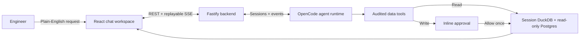

# DataStack One

### A conversational data-engineering workspace with human approval built in

[](https://nodejs.org/)
[](https://www.typescriptlang.org/)
[](https://react.dev/)
[](./LICENSE)

**DataStack One is “Vercel for internal data platforms.”** Connect files, an existing data
project, or a read-only Postgres database; describe the outcome in plain English; and let the
agent profile, query, transform, validate, and publish the data. Every write pauses for human
approval with the exact action visible before it runs.

Built for the **OpenAI Build Week — Work and Productivity** track using **Codex**.

## Demo

https://github.com/user-attachments/assets/ac9ba0cc-318c-4e57-ac0e-484e22fcbe9f

[Open the demo video](https://github.com/user-attachments/assets/ac9ba0cc-318c-4e57-ac0e-484e22fcbe9f) ·
[Follow the reproducible walkthrough](./DEMO.md)

## What it does

- **Natural-language data work:** ask the agent to profile, query, clean, transform, test, or
  publish data.
- **Real project folders:** start a session from an existing folder and use it as the agent's
  actual working directory.
- **Independent parallel sessions:** each chat owns its history, files, folder, DuckDB warehouse,
  model, approvals, and execution state. Switching chats never stops background work.
- **Files and databases:** upload multiple files or register Postgres/Neon in Settings and attach
  it read-only by name.
- **Visible agent activity:** Markdown responses, reasoning, tool calls, results, questions, and
  approvals stream into the conversation.
- **Human control:** file writes, database attachment, transforms, warehouse loads, and publishing
  require one-time inline approval.
- **Useful outputs:** inspect query results in the contextual data panel and publish approved,
  DQ-checked snapshots as JSON and CSV endpoints.

## How it works



The interface has three focused areas: independent sessions on the left, conversation in the
center, and an output-only data panel that appears when there is something useful to show.

## Setup and run

### Requirements

- Node.js **20 or newer**
- npm
- macOS, Linux, or Windows

DuckDB is embedded, so no database or external service is required for the main demo.

```bash
git clone https://github.com/X-ace-V/datastack-one.git
cd datastack-one
npm ci
npm run dev
```

Open **<http://localhost:5173>**. The backend runs at **<http://localhost:3001>**.

```bash
curl http://localhost:3001/api/health
```

Stop both processes with **Ctrl+C** in the terminal running `npm run dev`.

### Try the main flow

1. Create a session.
2. Use **Add** in the composer to upload `fixtures/loans_sample.csv` and `fixtures/rules.txt`, or
   start a session from an existing folder.
3. Ask: *“Profile this and show total balance by branch.”*
4. Ask: *“Clean it using the rules and publish a daily branch summary.”*
5. Review each proposed write and choose **Allow** or **Deny**.
6. Open the generated JSON endpoint or download its CSV snapshot.

For the full CSV and Postgres flow, use [`DEMO.md`](./DEMO.md).

### Optional local-folder restriction

The folder picker defaults to the user's home directory. Restrict it to dedicated project roots
with `DATASTACK_FOLDER_ROOTS` (`:` separated on macOS/Linux and `;` on Windows):

```bash
DATASTACK_FOLDER_ROOTS=/path/to/data-projects npm run dev
```

## Safety by design

- All mutating tools are approval-gated; there is no “always allow” path.
- Postgres is attached read-only, and credentials entered in Settings stay server-side.
- The agent receives connection names and schemas, never database URLs or passwords.
- Connected folders use canonical containment checks and reject traversal, symlinks, hidden
  files, generated directories, and common credential files.
- Every session has a private DuckDB catalog, so equal table or report names cannot collide.
- Published endpoints read the approved snapshot that passed DQ, not a later mutable table.

## Testing

```bash
npm test
npm run typecheck
```

The repository has more than 1,000 automated tests across domain logic, HTTP routes, OpenCode
events, session isolation, approval and question flows, tools, DuckDB behavior, and React UI. The
committed fixtures are synthetic, and the acceptance suite exercises the real local data path
without consuming model credits.

## How Codex helped

Codex was the engineering partner throughout the build. It helped research OpenCode's SDK and
live event behavior, design the multi-session architecture, implement the backend and React
workspace, reproduce runtime failures, and turn each fix into regression coverage.

The developer remained responsible for the important product decisions: replacing the original
wizard with conversation, making connected folders the agent's real working directory, isolating
parallel sessions, keeping credentials away from the model, requiring approval for every write,
and shaping the final UX. Codex accelerated implementation and verification; the developer chose
the direction and reviewed the result.

## Repository guide

```text
server/       Fastify API, OpenCode integration, DuckDB stores, tools, and workspace security
web/src/      React chat workspace, live session state, SSE client, and contextual data panel
fixtures/     Synthetic CSV, rules, and Postgres seed data
tests/        Integration and acceptance suites
data/         Local metadata, uploads, warehouses, and outputs (gitignored)
```

- [`DEMO.md`](./DEMO.md) — complete judge walkthrough
- [`PRD.md`](./PRD.md) — product requirements and acceptance contract
- [`ARCHITECTURE.md`](./ARCHITECTURE.md) — system design and trust boundaries
- [`API.md`](./API.md) — REST, SSE, and internal tool routes
- [`AGENTS.md`](./AGENTS.md) — engineering rules and lessons from the build

## Commands

| Command | Purpose |
|---|---|
| `npm run dev` | Start backend and web together. |
| `npm run dev:server` | Start Fastify and OpenCode on `:3001`. |
| `npm run dev:web` | Start Vite on `:5173`. |
| `npm test` | Run the complete Vitest suite. |
| `npm run typecheck` | Run strict TypeScript checks. |

## License

Released under the [MIT License](./LICENSE).

## Prototype status

DataStack One is a **two-day hackathon prototype**, so a few quirks are expected. The foundation
is working and well tested; the next step is to harden the product, expand its integrations, and
take it to production quality with further **GPT-5.6-powered development**.
